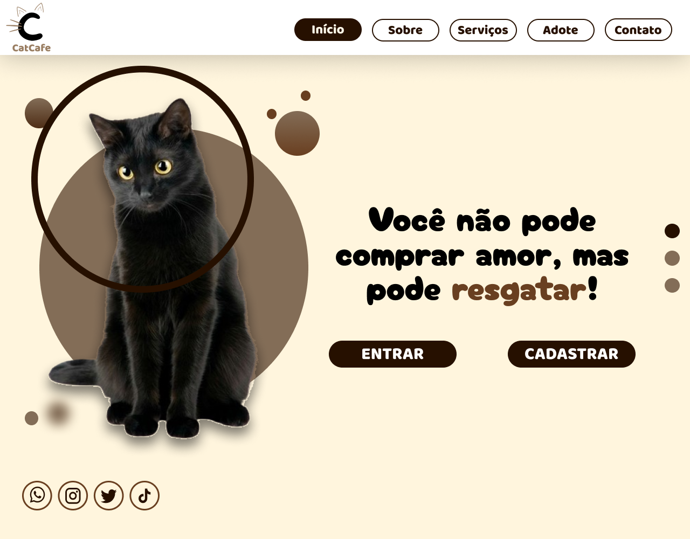

<h1 align='center'>Caffucinho</h1>

Projeto realizado em 2024, como parte para a aquisição de nota na matéria de Desenvolvimento de Sistemas na Etec Dr. Júlio Cardoso

  <a href='#-sobre'>Sobre</a>
  &nbsp&nbsp|&nbsp&nbsp
  <a href='#-desenvolvimento'>Desenvolvimento</a>
  &nbsp&nbsp|&nbsp&nbsp
  <a href='#-tecnologias'>Tecnologias</a>
  &nbsp&nbsp|&nbsp&nbsp
  <a href='#-licencas'>Licença</a>
  &nbsp&nbsp|&nbsp&nbsp
  <a href='https://www.figma.com/community/file/1422676439178901872/caffucinho'>Protótipo</a>

    

    

## 💁‍♂️ Sobre o Projeto
O projeto trata-se de um Website destinado à um restaurante de _Cat Café_ chamado Caffucinho e faz parte de um trabalho acadêmico, do qual os alunos deveriam desenvolver um sistema de uma empresa fictícia, buscando futuros clientes ou interessados.

## 📅 Desenvolvimento
O projeto foi realizado no segundo semestre de 2024, sendo meu primeiro toque ao React.js e ao Tailwind CSS. Seu desenvolvimento está estagnado na Landing Page, mas possuía objetivos de ter seu próprio banco de dados e back-end em Django.  
Foi prototipado anteriormente no [Figma](https://www.figma.com/community/file/1422676439178901872/caffucinho).

## 🤖 Tecnologias
Esse projeto foi realizado com as seguintes tecnologias:
<ul>
    <li>React.js</li>
    <li>Tailwind CSS</li>
    <li>Django</li>
    <li>Git e Github</li>
    <li>Figma</li>
</ul>

## 🔑 Licença
Este projeto está sob a licença MIT.

___

Desenvolvido por Pietro Pacheco 👤 Minhas redes sociais: <a href="https://linktr.ee/pietropacheco">Linktree</a>
